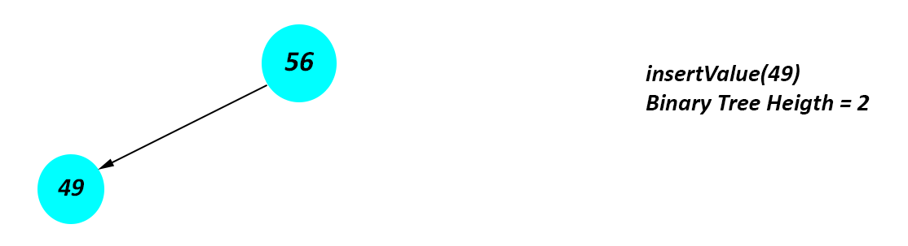
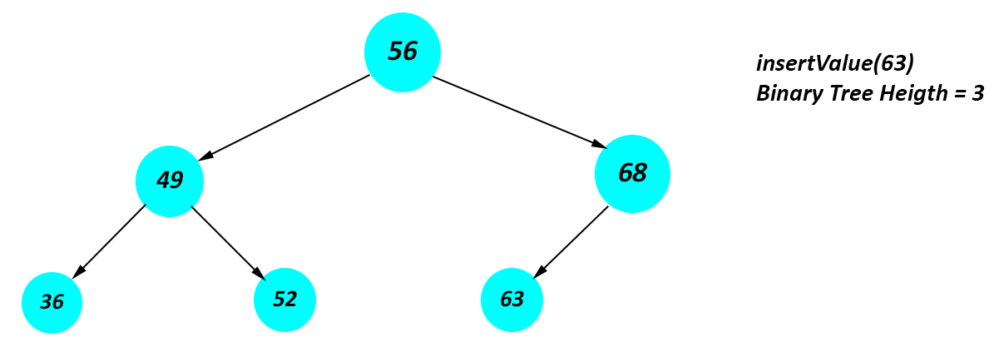

# Binary Tree Practice Question(s)

## Binary Search Tree

Design a binary search tree (BST) with the following methods:


1.  *`insertNode`* - This method will be responsible for inserting values into the BST. No value is to be returned.
1.  *`deleteNode`* - This method is responsible for deleting values in the BST. No value is to be returned.
1.  *`getMinimum`* - This method is responsible for getting the mininum value in the BST. An **integer** type is expected to be returned.
1.  *`getMaximum`* - This method is responsible for getting the maximum value in the BST. The expected return type is an **integer**.
1.  *`nodeExist`* - This method is responsible for finding a value in the BST. The expected return type is a **boolean**.
1.  *`inOrder`* - This method is responsible for traversing the BST in the left->parent->right order. The expected return type is a **list**.
1.  *`preOrder`* - This method is responsible for traversing the BST in the parent->left->right order. The expected return type is a **list**.
1.  *`postOrder`* - This method is responsible for traversing the BST in the left->right->parent order. The expected return type is a **list**.
1.  *`binaryTreeHeight`* - This method is responsible getting the height of the BST. The expected return type is an **integer**.
1.  *`isTreeSymmetric`* - This method is checking to if the BST is a mirror of itself. The expected return type is a **boolean**. Also give a brief docstring to your answer.
1.  *`treeDiameter`* - This method returns the value of the diameter of the BST. The expected return type is an **integer**.
> The diameter of a binary tree is the length of the longest path between any two nodes in a tree. This path may or may not pass through the root. The length of a path between two nodes is represented by the number of edges between them. 

***Note** You may use the code snippet below as a template. However, you may choose to implement a different design in the language you're most comfotable with.*

```py
class BinarySearchTree:
  def __init__(self, val=None):
    self.val = val
    self.rightChild = None
    self.leftChild = None

  def insertNode(self, val: int) -> None:
    # your code goes here

  def deleteNode(self, root: Optional[TreeNode], val: int) -> None:
    # your code goes here

  def getMinimum(self) -> int:
    # your code goes here

  def getMaximum(self) -> int:
    # your code goes here

  def nodeExist(self, val: int) -> bool:
    # your code goes here

  def inOrder(self, arr) -> List:
    # your code goes here

  def preOrder(self, arr) -> List:
    # your code goes here

  def postOrder(self, arr) -> List:
    # your code goes here

  def binaryTreeHeight(self, root: Optional[TreeNode]) -> int:
    # your code goes here

  def isTreeSymmetric(self) -> bool:
    # your code goes here

  def treeDiameter(self, root: Optional[TreeNode]) -> int:
    # your code goes here

  
  binarySearchTreeInputList = [12, 6, 18, 19, 21, 11, 3, 5, 4, 24, 18]
  root = BinarySearchTree()
  for num in binarySearchTreeInputList:
    root.insertNode(num)


  # Test
  print("preOrder is ",root.preOrder([]))  # ans = [12, 6, 3, 5, 4, 11, 18, 19, 21, 24]
  print("postOrder is ", root.postOrder([])) # ans = [4, 5, 3, 11, 6, 24, 21, 19, 18, 12]
  print("inOrder is ", root.inOrder([])) # ans = [3, 4, 5, 6, 11, 12, 18, 19, 21, 24]
  print("tree diameter value is", root.treeDiameter(root)) # ans = 8
  print("binaryTreeHeight is ", root.binaryTreeHeight(root)) # ans = 5
  root.deleteNode(root, 18)
  print("inOrder is again", root.inOrder([])) # ans = [3, 4, 5, 6, 11, 12, 19, 21, 24]
  print("tree diameter value is", root.treeDiameter(root)) # ans = 7
  print("inOrder is ", root.inOrder([]))  # ans = [3, 4, 5, 6, 11, 12, 19, 21, 24]
```


## Binary Tree

Design a binary tree (BT) with `insertValue(val)` method such that when this method is called, the value is added to the first null/None value in the tree from left to right. Also include the `getBinaryTreeHeight(node)` method which returns the height of the binary tree.


See the diagrams below to help visualize the expected behaviour.








### ***You may decide to take a different path in designing your solution. Happy coding.***